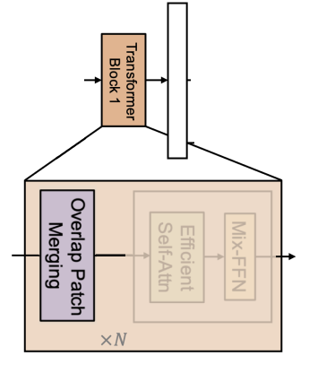

# Implementing SegFormer in PyTorch
*An fast, efficient and lightweight model for image segmentation*


Hello There!! Today we'll see how to implement SegFormer in PyTorch proposed in [SegFormer: Simple and Efficient Design for Semantic Segmentation with Transformers](https://arxiv.org/abs/2105.15203).

Code is here, an interactive version of this article can be downloaded from here.

Let's get started!

The paper proposes a new transformer-based model to tackle image segmentation. Even if "transformer" is nowadays a buzzword, and the model itself only has the basic attention mechanism. This model has two main advantages, first *SegFormer comprises a novel hierarchically structured Transformer encoder which outputs multiscale
features*. Then, *It does not need positional encoding, thereby avoiding the interpolation of
positional codes which leads to decreased performance when the testing resolution differs from training*. 

Funny enough, we are going backward in research, these two advantages are present in convnets since the beginning and we'll see that SegFormer, in the end, is just a convnet + attention.

The following picture shows SegFormer's performance against the different models/sizes on ADE20K dataset, they have **sota**.

</img>

It's better than the old good FCN-R50 and it's 2x faster. Since it has 24 fewer FLOPS I am wondering why it's only double as fast.

## Architecture

The model is a classic encoder-decoder/backbone-neck. A head is attached to predict the final segmentation mask. 

</img>

We are going to implement it in a bottom-up approach, starting from the lowest module inside the decoder. 

**The image in the paper is wrong** 🤦, I don't understand why any reviewers pointed that out, maybe I am wrong. In the official [implementation](https://github.com/NVlabs/SegFormer/blob/master/mmseg/models/backbones/mix_transformer.py) there isn't a first patch embedding. The overlapping patch merging block (the purple one) should be before the Self-Efficient Attention block.

This is how it should look like:

</img>

With a little photoshop

</img>


See the code [here](https://github.com/NVlabs/SegFormer/blob/9454025f0e74acbbc19c65cbbdf3ff8224997fe3/mmseg/models/backbones/mix_transformer.py#L318)

### Decoder

The Decoder used is called `MixVisionTransformer` (`MiT`), another `ViT` with some random stuff in the middle, we will call it `SegFormerDecoder`. Let's start with the first individual component of the block itself, `OverlapPatchMerging`.

#### OverlapPatchMerging

</img>

The `OverlapPatchMerging` block can be implemented with a convolution layer with a `stride` less than the `kernel_size`, so it overlaps different patches. It's the same thing proposed years ago when you use a `stride` greater than one to reduce the input's spatial dimension. In `SegFormer`, the conv layer is followed by a layer norm.

Since `nn.LayerNorm` in PyTorch works for tensors of shape `batch, ...., channels`, we can create a `LayerNorm2d` that first swaps the `channels` axis with the last one, then applies layer norm, and swaps it back. I'll use [`einops`](https://github.com/arogozhnikov/einops) to make the code more readable


```python
import torch
from einops import rearrange
from torch import nn

class LayerNorm2d(nn.LayerNorm):
    def forward(self, x):
        x = rearrange(x, "b c h w -> b h w c")
        x = super().forward(x)
        x = rearrange(x, "b h w c -> b c h w")
        return x
```

Then our `OverlapPatchMerging` is just a conv layer followed by our layer norm


```python
class OverlapPatchMerging(nn.Sequential):
    def __init__(
        self, in_channels: int, out_channels: int, patch_size: int, overlap_size: int
    ):
        super().__init__(
            nn.Conv2d(
                in_channels,
                out_channels,
                kernel_size=patch_size,
                stride=overlap_size,
                padding=patch_size // 2,
                bias=False
            ),
            LayerNorm2d(out_channels)
        )
```

#### Efficient Self Attention

</img>

We all know attention has a square complexity `O(N^2)` where `N=H*W` in our case. We can reduce `N` by a factor of `R`, the complexity becomes `O(N^2/R)`. One easy way is to flat the spatial dimension and use a linear layer. 


```python
r = 4
channels = 8
x = torch.randn((1, channels, 64, 64))
_, _, h, w = x.shape
# we want a vector of shape 1, 8, 32, 32
x = rearrange(x, "b c h w -> b (h w) c") # shape = [1, 4096, 8]
x = rearrange(x, "b (hw r) c -> b hw (c r)", r=r) # shape = [1, 1024, 32]
reducer = nn.Linear(channels*r, channels)
x = reducer(x) # shape = [1, 1024, 8]
half_r = r // 2
x = rearrange(x, "b (h w) c -> b c h w", h=h//half_r) # shape = [1, 8, 32, 32]
```

We have reduced the spatial size by `r=4`, so by `2` on each dimension (`height` and `width`). If you think about it, you can use a convolution layer with a `kernel_size=r` and a `stride=r` to achieve the same effect. 

Since the attention is equal to `softmax((QK^T/scale)V)`, we need to compute `K` and `V` using the reduced tensor otherwise shape won't match. `Q \in NxC, K \in (N/R)xC, V \in (N/R)xC`, we can use PyTorch's `MultiheadAttention` to compute the attention.


```python
class EfficientMultiHeadAttention(nn.Module):
    def __init__(self, channels: int, reduction_ratio: int = 1, num_heads: int = 8):
        super().__init__()
        self.reducer = nn.Sequential(
            nn.Conv2d(
                channels, channels, kernel_size=reduction_ratio, stride=reduction_ratio
            ),
            LayerNorm2d(channels),
        )
        self.att = nn.MultiheadAttention(
            channels, num_heads=num_heads, batch_first=True
        )

    def forward(self, x):
        _, _, h, w = x.shape
        reduced_x = self.reducer(x)
        # attention needs tensor of shape (batch, sequence_length, channels)
        reduced_x = rearrange(reduced_x, "b c h w -> b (h w) c")
        x = rearrange(x, "b c h w -> b (h w) c")
        out = self.att(x, reduced_x, reduced_x)[0]
        # reshape it back to (batch, channels, height, width)
        out = rearrange(out, "b (h w) c -> b c h w", h=h, w=w)
        return out
    
x = torch.randn((1, channels, 64, 64))
block = EfficientMultiHeadAttention(channels, reduction_ratio=r)
block(x).shape
```


    torch.Size([1, 8, 64, 64])


#### MixMLP
</img>

The careful reader may have noticed we are not using positional encoding. SegFormer uses a `3x3` depth-wise conv. Quoting from the paper *We argue that positional encoding is not necessary for semantic segmentation. Instead, we introduce Mix-FFN which considers the effect of zero padding to leak location information*. I have no idea what it means, so we will take it for granted.

I am pretty sure it's called **Mix** because it mixes information using the `3x3` conv.

The layer is composed by a `dense layer` -> `3x3 depth-wise conv` -> `GELU` -> `dense layer`. Like in ViT, this is an inverse bottleneck layer, the information is expanded in the middle layer.


```python
class MixMLP(nn.Sequential):
    def __init__(self, channels: int, expansion: int = 4):
        super().__init__(
            # dense layer
            nn.Conv2d(channels, channels, kernel_size=1),
            # depth wise conv
            nn.Conv2d(
                channels,
                channels * expansion,
                kernel_size=3,
                groups=channels,
                padding=1,
            ),
            nn.GELU(),
            # dense layer
            nn.Conv2d(channels * expansion, channels, kernel_size=1),
        )

```

### Encoder (Transformer) Block

</img>

Let's put everything together and create our Encoder Block. We will follow a better (imho) naming convention, we call `SegFormerEncoderBlock` the part with the self attention and the mix-fpn and `SegFormerEncoderStage` the whole overlap patch merging + N x `SegFormerEncoderBlock`


Very similar to `ViT`, we have skip connections and normalization layers + Stochastic Depth, also known as Drop Path, (I have an [article](https://towardsdatascience.com/implementing-stochastic-depth-drop-path-in-pytorch-291498c4a974) about it).


```python
from torchvision.ops import StochasticDepth

class ResidualAdd(nn.Module):
    """Just an util layer"""
    def __init__(self, fn):
        super().__init__()
        self.fn = fn

    def forward(self, x, **kwargs):
        out = self.fn(x, **kwargs)
        x = x + out
        return x

class SegFormerEncoderBlock(nn.Sequential):
    def __init__(
        self,
        channels: int,
        reduction_ratio: int = 1,
        num_heads: int = 8,
        mlp_expansion: int = 4,
        drop_path_prob: float = .0
    ):
        super().__init__(
            ResidualAdd(
                nn.Sequential(
                    LayerNorm2d(channels),
                    EfficientMultiHeadAttention(channels, reduction_ratio, num_heads),
                )
            ),
            ResidualAdd(
                nn.Sequential(
                    LayerNorm2d(channels),
                    MixMLP(channels, expansion=mlp_expansion),
                    StochasticDepth(p=drop_path_prob, mode="batch")
                )
            ),
        )


x = torch.randn((1, channels, 64, 64))
block = SegFormerEncoderBlock(channels, reduction_ratio=r)
block(x).shape
```


    torch.Size([1, 8, 64, 64])


Okay, let's create a stage. I don't know why, they apply layer norm at the end, so we'll do the same :) 


```python
from typing import List

class SegFormerEncoderStage(nn.Sequential):
    def __init__(
        self,
        in_channels: int,
        out_channels: int,
        patch_size: int,
        overlap_size: int,
        drop_probs: List[int],
        depth: int = 2,
        reduction_ratio: int = 1,
        num_heads: int = 8,
        mlp_expansion: int = 4,
    ):
        super().__init__()
        self.overlap_patch_merge = OverlapPatchMerging(
            in_channels, out_channels, patch_size, overlap_size,
        )
        self.blocks = nn.Sequential(
            *[
                SegFormerEncoderBlock(
                    out_channels, reduction_ratio, num_heads, mlp_expansion, drop_probs[i]
                )
                for i in range(depth)
            ]
        )
        self.norm = LayerNorm2d(out_channels)
```

The final `SegFormerEncoder` is composed by multiple stages.


```python
from typing import Iterable

def chunks(data: Iterable, sizes: List[int]):
    """
    Given an iterable, returns slices using sizes as indices
    """
    curr = 0
    for size in sizes:
        chunk = data[curr: curr + size]
        curr += size
        yield chunk
        
class SegFormerEncoder(nn.Module):
    def __init__(
        self,
        in_channels: int,
        widths: List[int],
        depths: List[int],
        all_num_heads: List[int],
        patch_sizes: List[int],
        overlap_sizes: List[int],
        reduction_ratios: List[int],
        mlp_expansions: List[int],
        drop_prob: float = .0
    ):
        super().__init__()
        # create drop paths probabilities (one for each stage's block)
        drop_probs =  [x.item() for x in torch.linspace(0, drop_prob, sum(depths))]
        self.stages = nn.ModuleList(
            [
                SegFormerEncoderStage(*args)
                for args in zip(
                    [in_channels, *widths],
                    widths,
                    patch_sizes,
                    overlap_sizes,
                    chunks(drop_probs, sizes=depths),
                    depths,
                    reduction_ratios,
                    all_num_heads,
                    mlp_expansions
                )
            ]
        )
        
    def forward(self, x):
        features = []
        for stage in self.stages:
            x = stage(x)
            features.append(x)
        return features

```

I've added the function `chunks` to keep the code clean. It works like this


```python
data = [1,2,3,4,5]
sizes = [2,3]
list(chunks(data, sizes))
```


    [[1, 2], [3, 4, 5]]


It is handy since `drop_probs` is a list containing the drop path probabilities for each stage's block and we need to pass a list with the correct values to each stage. 

From the encoder, we return a list of inner features, one from each stage.

## Decoder / Neck

Luckily, the decoder/neck's picture matches the original code. They called the decoder part `MLP Layer`.

</img>

What it does is very simple, it takes `F` features with sizes `batch, channels_i, height_i, width_i` and outputs `F'` features of the same spatial and channel size. The spatial size is fixed to `first_features_spatial_size / 4`. In our case, since our input is a `224x224` image, the output will be a `56x56` mask.

So a single `SegFormerDecoderBlock` contains one upsample layer (for the spatial dimension) and one conv layer (for the channels). The `scale_factor` parameter is needed to tell it how much we want to upsample the feature.


```python
class SegFormerDecoderBlock(nn.Sequential):
    def __init__(self, in_channels: int, out_channels: int, scale_factor: int = 2):
        super().__init__(
            nn.UpsamplingBilinear2d(scale_factor=scale_factor),
            nn.Conv2d(in_channels, out_channels, kernel_size=1),
        )
```

In this case, we don't have stages, so our `SegFormerDecoder` is just a list of blocks. It takes a list of features and returns a list of new features with the same spatial size and channels.


```python
class SegFormerDecoder(nn.Module):
    def __init__(self, out_channels: int, widths: List[int], scale_factors: List[int]):
        super().__init__()
        self.stages = nn.ModuleList(
            [
                SegFormerDecoderBlock(in_channels, out_channels, scale_factor)
                for in_channels, scale_factor in zip(widths, scale_factors)
            ]
        )
    
    def forward(self, features):
        new_features = []
        for feature, stage in zip(features,self.stages):
            x = stage(feature)
            new_features.append(x)
        return new_features
```

## SegFormer Head

</img>


We are almost there! The decoder's features are concatenated (remember they all have the same channels and spatial dimensions) on the channel axis. Then, they are passed to a segmentation head to reduce them from `channels * number of features` to `channels`. Finally, a dense layer outputs the final segmentation.


```python
class SegFormerSegmentationHead(nn.Module):
    def __init__(self, channels: int, num_classes: int, num_features: int = 4):
        super().__init__()
        self.fuse = nn.Sequential(
            nn.Conv2d(channels * num_features, channels, kernel_size=1, bias=False),
            nn.ReLU(), # why relu? Who knows
            nn.BatchNorm2d(channels) # why batchnorm and not layer norm? Idk
        )
        self.predict = nn.Conv2d(channels, num_classes, kernel_size=1)

    def forward(self, features):
        x = torch.cat(features, dim=1)
        x = self.fuse(x)
        x = self.predict(x)
        return x
```

## SegFormer

Well, our final model is just `encoder + decoder + head`. Easy peasy


```python
class SegFormer(nn.Module):
    def __init__(
        self,
        in_channels: int,
        widths: List[int],
        depths: List[int],
        all_num_heads: List[int],
        patch_sizes: List[int],
        overlap_sizes: List[int],
        reduction_ratios: List[int],
        mlp_expansions: List[int],
        decoder_channels: int,
        scale_factors: List[int],
        num_classes: int,
        drop_prob: float = 0.0,
    ):

        super().__init__()
        self.encoder = SegFormerEncoder(
            in_channels,
            widths,
            depths,
            all_num_heads,
            patch_sizes,
            overlap_sizes,
            reduction_ratios,
            mlp_expansions,
            drop_prob,
        )
        self.decoder = SegFormerDecoder(decoder_channels, widths[::-1], scale_factors)
        self.head = SegFormerSegmentationHead(
            decoder_channels, num_classes, num_features=len(widths)
        )

    def forward(self, x):
        features = self.encoder(x)
        features = self.decoder(features[::-1])
        segmentation = self.head(features)
        return segmentation
```

Let's try it!


```python
segformer = SegFormer(
    in_channels=3,
    widths=[64, 128, 256, 512],
    depths=[3, 4, 6, 3],
    all_num_heads=[1, 2, 4, 8],
    patch_sizes=[7, 3, 3, 3],
    overlap_sizes=[4, 2, 2, 2],
    reduction_ratios=[8, 4, 2, 1],
    mlp_expansions=[4, 4, 4, 4],
    decoder_channels=256,
    scale_factors=[8, 4, 2, 1],
    num_classes=100,
)

segmentation = segformer(torch.randn((1, 3, 224, 224)))
segmentation.shape # torch.Size([1, 100, 56, 56])
```


    torch.Size([1, 100, 56, 56])


The output is correct, we expect a mask of spatial shape `image_size // 4` and `224 // 4 = 56`.

We did it! 🎉🎉🎉

## Conclusions


In this article we have seen, step by step, how to create SegFormer; a fast and efficient model for image segmentation.

Thank you for reading it!

Francesco
